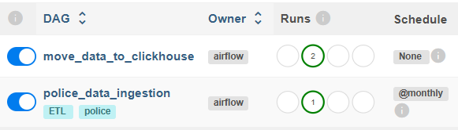

# Project 2. Data warehouse implementation, ETL pipelines
In this phase, we implement a working data pipeline that ingests, transforms, and loads data into an analytical warehouse. 

The project uses the following technologies:
- **Apache Airflow** to orchestrate and schedule data pipeline.
- **ClickHouse** for analytical storage.
- **dbt** for making data transformations.
- **Docker** to containerize services and ensure the environment is consistent and reproducible across different machines.

The goal is to build an automated pipeline that ensures data is clean, transformed, and available for analytics.

---

## Table of Contents
- [Overview](#overview)
- [Services](#services)
- [Project structure](#project-structure)
- [Environment setup](#environment_setup)
- [Airflow DAGs](#airflow-dags)
- [Analytical queries](#analytical-queries)

---

## Overview
Two data sources are used for **street-level crime** and **stop and search** data for London from [data.police.uk.](https://data.police.uk/): 
- downloadable CSV files
- API

The ingested raw data will be loaded into ClickHouse Bronze layer. The Silver layer contains cleaned data, the Gold layer includes transformed data modeled according to the dimensional model using dbt.

...

---

## Project structure
```text
Phase 2/
├── .env
├── .gitignore
├── airflow-docker/
|   ├── configs
│   ├── dags/
│   └── docker-compose.yaml
├── dbt/
|    ├── models/
|    ├── dbt_project.yml
|    └── profiles.yml
└── images/
    └── airflow_dags.png
```
---

## Services
The project includes a ready-to-run Docker Compose setup with the following services:
- **Airflow Webserver** for monitoring and managing pipelines.
- **Airflow Scheduler** to schedule and trigger DAGs.
- **Postgres** serves as the Airflow metadata database and staging area.
- **pgAdmin** for managing the Postgres database.
- **ClickHouse** as the analytical warehouse.
- **dbt** to transform data from the Bronze to the Gold layer.
---

## Environment setup
Step-by-step instructions to get the project running locally.

> :heavy_check_mark: All login credentials are in .env file.

**1. Create a project folder locally** where to clone the Git repository

**2. Navigate into the project folder and clone the repository**:

```bash
cd your_project_folder

git clone https://github.com/RobertI321/data_engineering_project.git
```
**3. Start the services** using "docker-compose.yaml" in the airflow-docker folder:
> :warning: Make sure that Docker is running before starting the project.
```bash
cd "data_engineering_project/Phase 2/airflow-docker"
docker compose up -d
```
**4. Connect to pgAdmin** and create a new server:
1. Acces pgAdmin at [http://localhost:5050](http://localhost:5050)
2. Register a new server
    - Name: server
    - Host name: project-db
    - Port: 5432
    - Maintenace databse: project_db
    - Username and password: in .env file

**5. Connect to Airflow UI:**
1. Access Airflow at [http://localhost:8080](http://localhost:8080)
2. To ingest raw data into the staging layer in the Postgres database, run the DAG **police_data_ingestion**.
3. To move data into the ClickHouse Bronze layer, run the DAG **move_data_to_clickhouse**.

...
---

## Airflow DAGs

The DAGs can be managed through the Airflow Web UI:



- **police_data_ingestion**:
    - automates the ingestion of police crime and stop-and-search data for the Cambridgeshire region from the [UK Police data service](https://data.police.uk/)
    - retrieves metadata (available months) via the API and downloads the corresponding montly data archive as zipped CSV files
    - scheduled to run monthly, as new data becomes available each month
    - loads the latest month's raw data into Postgres database (staging)
    - ensures idempotent loading - already ingested months are skipped to prevent duplicates. 

- **move_data_to_clickhouse**
    - transfers raw data from Postgres staging area into the ClickHouse Bronze layer
    - run manually after raw data has been successfully ingested
    - ensures idempotent loading - deletes existing data for a given month, and removes rows for the same month before reloading
    - executes dbt models using the newly loaded data, transforming it into the Silver and Gold layers in ClickHouse
    - runs dbt tests (validations, e.g., unique and not null constraints) to verify data quality
    - dbt tasks are dependent on loading data: all load tasks must be completed before dbt transformations start.

## Analytical queries

Revised business questions from Project 1 are answered using dbt models and queries:

1. Are some ethnic groups stopped more often than others?
2. What is the rate of justified searches for each ethnic group? 
    - A justified search is one that leads to criminal charges or other legal actions.
3. How effective are stop-and-search operations, in terms of yielding an outcome linked to the search objective?
4. Are there differences by area in terms of effective outcome (stop-and-search led to action)?
5. Are there certain months or seasons when crime and stop-and-search both increase?
6. What types of crimes are most commonly closed with no suspect identified?